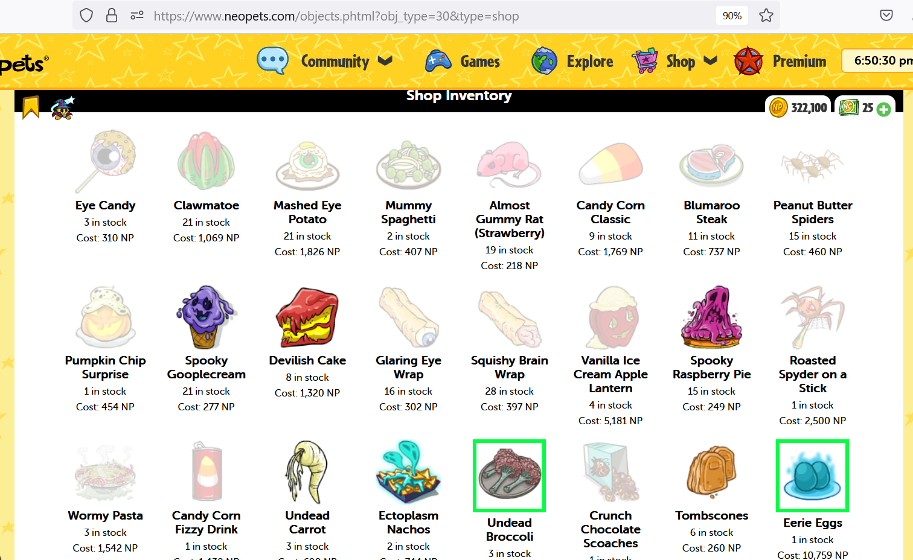

# Neopets-visual-restock-assist
This is a firefox add-on.

Loads lists of items provided by the user and applies them to CSS in neopets shops, helping users to restock valuable items. Only the style changes.

